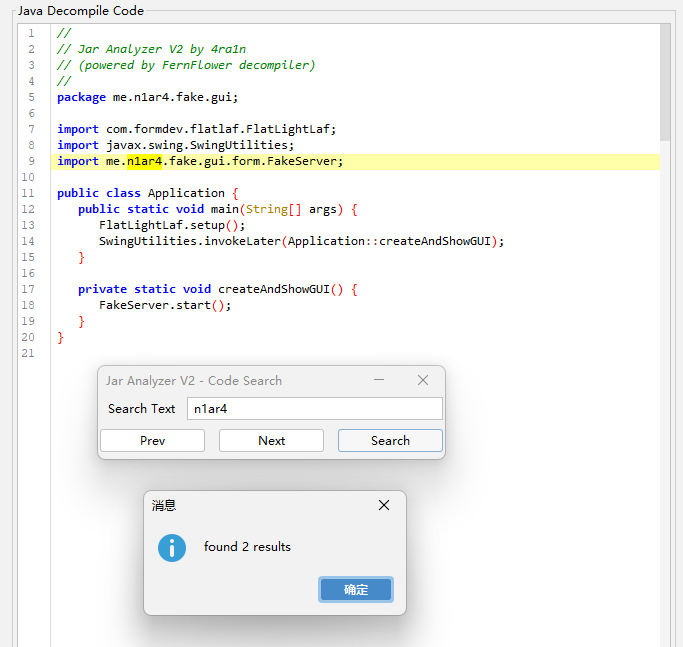
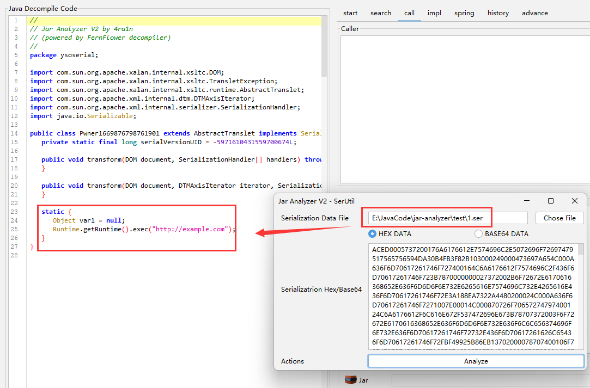
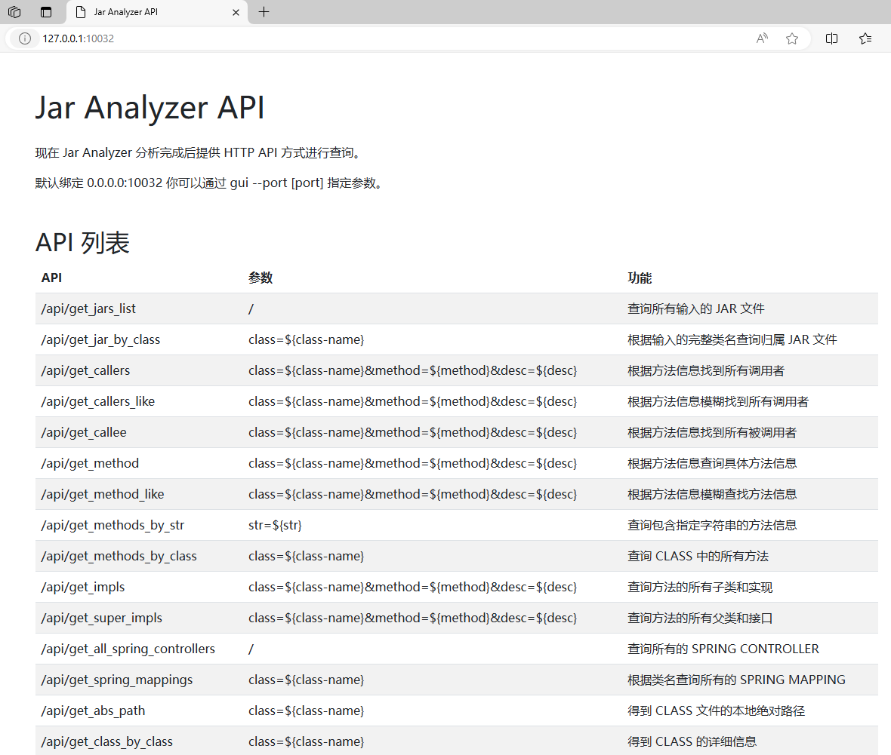
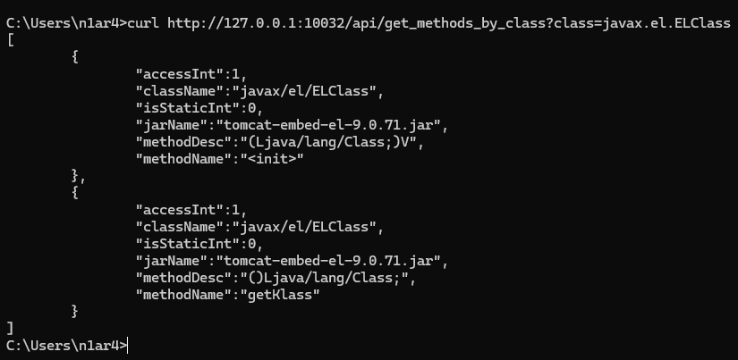
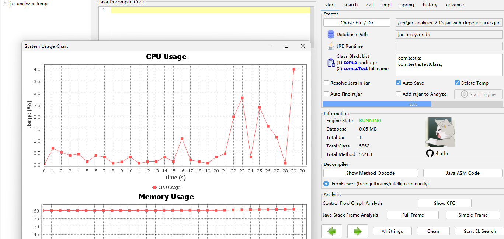
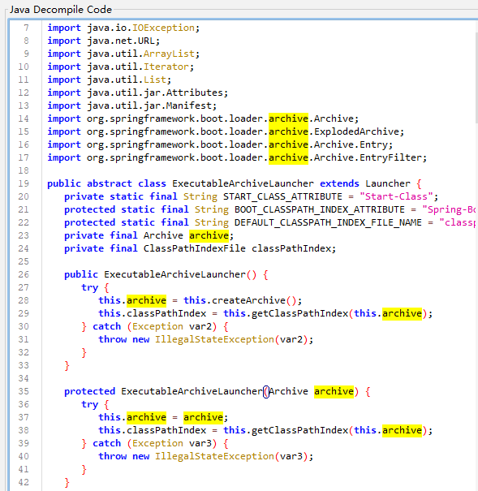

# Jar-Analyzer V2

[CHANGE LOG](src/main/resources/CHANGELOG.MD)


`Jar Analyzer` 是一个分析 `Jar` 文件的 `GUI` 工具：

- 支持大 `Jar` 以及批量 `Jars` 分析
- 方便地搜索方法之间的调用关系
- 分析 `LDC` 指令定位 `Jar` 中的字符串
- 一键分析 `Spring Controller/Mapping`
- 对于方法字节码和指令的高级分析
- 一键反编译，优化对内部类的处理
- 一键生成方法的 `CFG` 分析结果
- 一键生成方法的 `Stack Frame` 分析结果
- 远程分析 `Tomcat` 中的 `Servlet` 等组件
- 自定义 `SQL` 语句进行高级分析
- 集成 `ClazzSearcher` 项目作为命令行分析版本
- 允许从字节码层面直接修改方法名（测试功能）
- 自从 `2.14` 版本之后支持了全屏显示的功能
- 自从 `2.15` 版本后支持代码区域字符串搜索功能
- 自从 `2.15` 版本后支持通过 `HTTP` 分析远程文件
- 自从 `2.16` 版本后支持一键导出反编译 `JAVA` 代码
- 自从 `2.17` 版本后支持字节码指令级别的远程调试（参考 [示例图](img/0035.png)）
- 自从 `2.17` 版本后支持从序列化数据一键提取恶意 `JAVA` 代码（参考 [示例图](img/0036.png)）
- 自从 `2.18` 版本后支持 `HTTP API` 查询接口（参考 [示例图](img/0038.png)）
- 自从 `2.19` 版本后支持启动时配置 `10` 种 `UI` 主题（`LookAndFeel`）
- 自从 `2.19` 版本后支持实时的 `CPU` 占用和内存的折线图展示（参考 [示例图](img/0040.png)）
- 自从 `2.20` 版本后支持选中字符串全局高亮显示（参考 [示例图](img/0041.png)）
- 自从 `2.21` 版本后支持分析配置类和包名的白名单
- 自从 `2.21` 版本后支持左侧文件数使用 `CTRL+F` 打开类名搜索（参考 [示例图](img/0045.png)）
- 自从 `2.21` 版本后新增内置开启 `ZGC` 的 `JRE 21` 环境（仅包含核心功能）
- 自从 `2.23` 版本后新增 `SCA` 分析（可支持 `FAT JAR` 和 `LIB JAR` 多种）

什么是 `SCA` 分析：输入 `JAR` 文件后根据特定 `CLASS` 的 `HASH` 和规则匹配到 `CVE` 漏洞


更多的功能正在开发中

有问题和建议欢迎提 `issue`

[前往下载](https://github.com/jar-analyzer/jar-analyzer/releases/latest)

`Jar Analyzer` 的用途

- 场景1：从大量 `JAR` 中分析某个方法在哪个 `JAR` 里定义（精确到具体类具体方法）
- 场景2：从大量 `JAR` 中分析哪里调用了 `Runtime.exec` 方法（精确到具体类具体方法）
- 场景3：从大量 `JAR` 中分析字符串 `${jndi` 出现在哪些方法（精确到具体类具体方法）
- 场景4：从大量 `JAR` 中分析有哪些 `Spring Controller/Mapping` 信息（精确到具体类具体方法）
- 场景5：你需要深入地分析某个方法中 `JVM` 指令调用的传参（带有图形界面）
- 场景6：你需要深入地分析某个方法中 `JVM` 指令和栈帧的状态（带有图形界面）
- 场景7：你需要深入地分析某个方法的 `Control Flow Graph` （带有图形界面）
- 场景8：你有一个 `Tomcat` 需要远程分析其中的 `Servlet/Filter/Listener` 信息
- 场景9：查实现接口 `A` 继承接口 `B` 类注解 `C` 且方法名 `test` 方法内调用 `D` 类 `a` 方法的方法（表达式搜索）
- 测试功能：字节码指令级别的调试 | 远程分析 | 一键导出反编译代码

## 相关

用户使用文章

- [利用 jar-analyzer 分析 CVE-2022-42889](https://zone.huoxian.cn/d/2884-jar-analyzer-cve-2022-42889)
- [某人力系统的代码审计](https://forum.butian.net/share/3109)

用户使用视频

- [Jar Analyzer V2 教程（早期版本）](https://www.bilibili.com/video/BV1ac411S7q4)
- [通过 jar-analyzer 分析漏洞 CVE-2022-42889](https://www.bilibili.com/video/BV1a94y1E7Nn)
- [Jar Analyzer V2 新版本功能介绍](https://www.bilibili.com/video/BV1Dm421G75i)

漏洞公告

- [\[GHSA-43rf-3hm4-hv5f\] 反编译恶意的 CLASS 文件可能导致程序不可用](https://github.com/jar-analyzer/jar-analyzer/security/advisories/GHSA-43rf-3hm4-hv5f)
- [\[GHSA-x5h2-78p8-w943\] Jar Analyzer 2.13 版本之前存在 SQL 注入漏洞](https://github.com/jar-analyzer/jar-analyzer/security/advisories/GHSA-x5h2-78p8-w943)
- [\[GHSA-jmcg-r2c5-7m29\] Jar Analyzer 存在 ZIP SLIP 漏洞（最坏情况可导致 RCE 风险）](https://github.com/jar-analyzer/jar-analyzer/security/advisories/GHSA-jmcg-r2c5-7m29)

## 截图

方法调用关系


方法调用搜索 (支持 `equals/like` 选项，支持黑名单过滤)


分析 `Spring Framework`


`Jar Analyzer 2.15` 版本以后支持代码区域的搜索



`Jar Analyzer 2.15` 版本以后支持远程 `Jar` 文件加载


`Jar Analyzer 2.17` 版本以后支持从序列化数据中一键提取恶意代码



`Jar Analyzer 2.18` 版本以后支持 `HTTP API`





`Jar Analyzer 2.19` 版本以后支持实时的 `CPU` 和内存占用分析



`Jar Analyzer 2.20` 版本后支持选中字符串全局高亮显示



## 进阶功能

以上是基础功能，进阶和测试性的功能请参考：[进阶测试性功能](doc/README-advance.md)

## 性能对比

分析同一个 `20 MB` 大小的 `JAR` 文件对比

`JRE 8` 性能 48 秒


`JRE 21` 性能 46 秒


新版本同时支持了内置 `JAVA 8` 和 `JAVA 21` 的版本

## 快捷键

- `CTRL+X` 方法交叉引用 快速跳转方法 `caller` 和 `callee` 页面
- `CTRL+F` 代码区域搜索 打开搜索面板 支持 `next` 和 `prev` 选项
- `CTRL+F` 文件树区搜索 显示搜索面板 搜索文件树中的类名以及内部类

## UI 主题

支持以下：

- default (默认使用 类似 `IDEA` 主题)
- metal
- win (仅 `Windows` 支持)
- win-classic (仅 `Windows` 支持)
- motif
- mac (仅 `MacOS` 支持)
- gtk (仅某些 `Linux` 支持)
- cross
- aqua (仅 `MacOS` 支持)
- nimbus

在启动时指定：`java -jar jar-analyzer.jar gui -t [theme]`

例如：`java -jar jar-analyzer.jar gui -t win-classic`

或者修改启动脚本的代码

```shell
set "theme_name=default"
```

## 命令行

[文档](doc/README-cli.md)

## 表达式

[文档](doc/README-el.md)

## 注意

[文档](doc/README-note.md)

## 子项目

[文档](doc/README-sub.md)

## 其他

[文档](doc/README-others.md)

## 参考

[文档](doc/README-thanks.md)

## API

[文档](doc/README-api.md)

## BUILD

编译和构建过程如下：

1. 构建核心项目 `mvn -B clean package -DskipTests --file pom.xml`
2. 构建`agent`子项目 `mvn -B clean package -DskipTests --file agent\pom.xml`
3. 构建命令行子项目 `mvn -B clean package -DskipTests --file class-searcher\pom.xml`
4. 构建`rasp`子项目 `mvn -B clean package -DskipTests --file jar-analyzer-rasp\pom.xml`
5. 使用`cmake`构建`native`目录的`C`代码生成`dll`文件放入`resources`
6. 使用`winres`和`gcc`构建启动`exe`文件和图标信息
7. 参考`build.py`和`build.yml`文件进行最终的文件合并和版本构建

## Thanks


This project is developed using JetBrains IDEA.
Thanks to JetBrains for providing me with a free license, which is a strong support for me.
