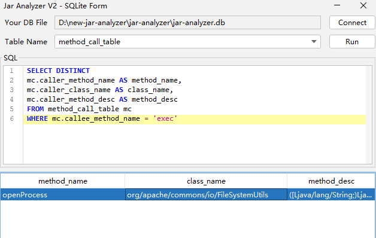
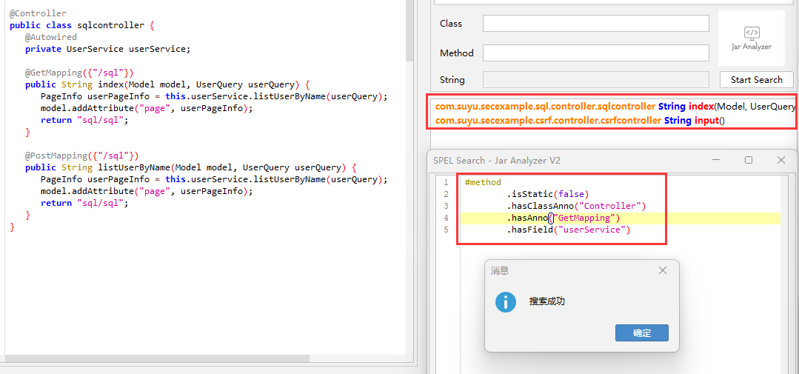

# Jar-Analyzer V2

[ENGLISH DOC](doc/README-en.md)

[CHANGE LOG](src/main/resources/CHANGELOG.MD)


`Jar Analyzer` 是一个分析 `Jar` 文件的 `GUI` 工具：
- 支持大 `Jar` 以及批量 `Jars` 分析
- 方便地搜索方法之间的调用关系
- 分析 `LDC` 指令定位 `Jar` 中的字符串
- 一键分析 `Spring Controller/Mapping`
- 对于方法字节码和指令的高级分析
- 一键反编译，优化对内部类的处理
- 一键生成方法的 `CFG` 分析结果
- 一键生成方法的 `Stack Frame` 分析结果
- 远程分析 `Tomcat` 中的 `Servlet` 等组件
- 自定义 `SQL` 语句进行高级分析
- 允许从字节码层面直接修改方法名（测试功能）

更多的功能正在开发中

有问题和建议欢迎提 `issue`

[前往下载](https://github.com/jar-analyzer/jar-analyzer/releases/latest)

`Jar Analyzer` 的用途
- 场景1：从大量 `JAR` 中分析某个方法在哪个 `JAR` 里定义（精确到具体类具体方法）
- 场景2：从大量 `JAR` 中分析哪里调用了 `Runtime.exec` 方法（精确到具体类具体方法）
- 场景3：从大量 `JAR` 中分析字符串 `${jndi` 出现在哪些方法（精确到具体类具体方法）
- 场景4：从大量 `JAR` 中分析有哪些 `Spring Controller/Mapping` 信息（精确到具体类具体方法）
- 场景5：你需要深入地分析某个方法中 `JVM` 指令调用的传参（带有图形界面）
- 场景6：你需要深入地分析某个方法中 `JVM` 指令和栈帧的状态（带有图形界面）
- 场景7：你需要深入地分析某个方法的 `Control Flow Graph` （带有图形界面）
- 场景8：你有一个 `Tomcat` 需要远程分析其中的 `Servlet/Filter/Listener` 信息

## 一些截图

指令分析


`CFG` 分析


带图形的 `Stack Frame` 分析


分析 `Spring Framework`


从 `2.8` 版本开始支持 `tomcat` 分析（一检查杀内存马）


自定义 `SQL` 语句任意分析



方法调用搜索 (支持 `equals/like` 选项，支持黑名单过滤)


方法调用关系


`Jar Analyzer 2.12` 版本以后使用自研 `RASP` 保护程序

(Runtime Application Self-Protection)


## 表达式搜索

表达式搜索位于首页以及 `Advance` 的 `Plugins` 部分


在 `2.12` 版本以后支持超强的表达式搜索，可以随意组合以搜索你想要的信息

由于该功能从 `Jar Analyzer V1` 版本迁移过滤，老版本使用内存数据库效率较高，新版使用 `sqlite` 查询速度会降低

| 表达式               | 参数         | 作用       | 
|:------------------|:-----------|:---------|
| nameContains      | String     | 方法名包含    |
| startWith         | String     | 方法前缀     |
| endWith           | String     | 方法后缀     |
| classNameContains | String     | 类名包含     |
| returnType        | String     | 方法返回类型   |
| paramTypeMap      | int String | 方法参数对应关系 |
| paramsNum         | int        | 方法参数个数   |
| isStatic          | boolean    | 方法是否静态   |
| isSubClassOf      | String     | 是谁的子类    |
| isSuperClassOf    | String     | 是谁的父类    |
| hasAnno           | String     | 方法的注解    |
| hasClassAnno      | String     | 类的注解     |
| hasField          | String     | 类字段      |

注意：
- `returnType`和`paramTypeMap`要求类似是完整类名，例如`java.lang.String`，基础类型直接写即可例如`int`
- `isSubClassOf`和`isSuperClassOf`要求完整类名，例如`java.awt.Component`
- `hasAnno`和`hasClassAnno`不要求完整类名，直接写即可例如`Controller`

### 1.基础搜索

搜索的基础是方法，你希望搜索怎样的方法

例如我希望搜索方法名以`set`开头并以`value`结尾的方法

```java
#method
        .startWith("set")
        .endWith("value")
```

例如我希望搜索类名包含`Context`且方法名包含`lookup`的方法

```java
#method
        .nameContains("lookup")
        .classNameContains("Context")
```

例如我希望搜索返回`Process`类型共3个参数且第二个参数为`String`的方法

```java
#method
        .returnType("java.lang.Process")
        .paramsNum(3)
        .paramTypeMap(1,"java.lang.String")
```

### 2.子类与父类

比如我们想找`javax.naming.spi.ObjectFactory`的所有子类（包括子类的子类等）

编写以下规则即可，程序内部会递归地寻找所有的父类

```java
#method
        .isSubClassOf("javax.naming.spi.ObjectFactory")
```

如果想找某个类的所有父类，使用`isSuperClassOf`即可（注意全类名）

注意以上会直接找到所有符合条件类的所有方法，所以我建议再加一些过滤

例如

```java
#method
        .isSubClassOf("javax.naming.spi.ObjectFactory")
        .startWith("xxx")
        .paramsNum(0)
```

### 3.注解搜索

比如我们想找`@Controller`注解的所有类的所有方法

编写以下规则

```java
#method
        .hasClassAnno("Controller")
```

比如想找`@RequestMapping`注解的所有方法

```java
#method
        .hasAnno("RequestMapping")
```

同样地由于找到的是所有符合条件类的所有方法，所以我建议再加一些过滤

### 4.实际案例

现在有一个 `Spring Controller`

我想搜索某个 `Controller` 中包含 `userService` 字段且是 `GetMapping` 的方法

```java
@Controller
public class sqlcontroller {
    @Autowired
    private UserService userService;

    @GetMapping({"/sql"})
    public String index(Model model, UserQuery userQuery) {
        PageInfo userPageInfo = this.userService.listUserByName(userQuery);
        model.addAttribute("page", userPageInfo);
        return "sql/sql";
    }
}
```

于是可以编写一个表达式

```java
#method
        .isStatic(false)
        .hasClassAnno("Controller")
        .hasAnno("GetMapping")
        .hasField("userService")
```

参考图片



## 注意事项

### 显示问题

如果 `Mac` 无法显示完全，请在显示器设置中勾选 `更多空间`


### 乱码问题

注意：
- 在 `Windows` 下请勿双击启动，请使用 `java -jar` 或双击 `bat` 脚本启动
- 如果使用 `java -jar` 启动乱码，请加入 `-Dfile.encoding=UTF-8` 参数

### 显示问题

本工具已经根据 `1080P` 适配 （考虑到绝大多数机器应该大于等于这个分辨率）

如果你的电脑在 `1080P` 下无法正常显示，请调整缩放到 `100%`

以 `Windows 11` 为例：右键显示设置


### 原理相关

本工具的基本原理：
- 解压所有 `Jar` 文件到 `jar-analyzer-temp` 目录
- 在当前目录构建数据库 `jar-analyzer.db` 文件
- 在当前目录新建文件 `.jar-analyzer` 记录状态


注意：当 `Jar` 数量较多或巨大时**可能导致临时目录和数据库文件巨大**

### 命令行使用

如果你不想使用 `GUI` 版本，本项目也支持命令行方式:

```text
Usage: java -jar jar-analyzer.jar [command] [command options]
  Commands:
    build      build database
      Usage: build [options]
        Options:
          --del-cache
            delete old cache
            Default: false
          --del-exist
            delete old database
            Default: false
          -j, --jar
            jar file/dir

    gui      start jar-analyzer gui
      Usage: gui
```

示例：对当前目录的 `test.jar` 进行分析和构建数据库，并删除缓存和当前目录旧数据库

```shell
java -jar jar-analyzer.jar build --jar 1.jar --del-cache --del-exist
```

### 视频演示

[B站视频教程](https://www.bilibili.com/video/BV1ac411S7q4/)

## Release 说明

所有可供下载的文件都由 `Github Actions` 构建，提供以下四种:

- `windows-full` 版内置 `JRE 8` 环境 (**完整功能版本**)
- `windows-system` 版使用系统 `JDK` 的启动脚本 (需要自行安装 `JRE`)
- `zip` 版仅包含简单的 `jar` 文件 (使用 `java -jar` 启动)

推荐使用 `windows-full` 版，功能齐全，其他版本某些功能可能不可用

由于本工具仅在 `Windows` 和 `Java 8` 中测试，其他环境可能有未知的问题，欢迎提 `issue`

## 子项目

### Tomcat Analyzer

该项目位于`me.n1ar4.shell.analyzer`中，这是一个分析`Tomcat`内存马的工具

[代码](src/main/java/me/n1ar4/shell/analyzer)

该项目原名`shell-analyzer`现改名`tomcat-analyzer`

(1) 第一步：检测进程并`Attach`


为了防止目标被恶意利用，需要输入一个密码

**注意：尽管使用了密码保护，但还是存在拒绝服务等风险，请勿在生产环境使用，目前适用于自己搭建靶机分析学习**

(2) 第二步：勾选并分析

点击**刷新**即可获得实时的数据

(3) 双击任意一个类即可`Dump`并反编译

(4) 复制类名过去即可修复内存马


将`Agent`动态`Attach`到目标后会开启一个端口(10032)监听：
- 该端口会反序列化收到的数据，然后处理，我已经给反序列化设置了白名单进行保护
- 启动`Agent`时会设置密码，如果客户端连接密码不匹配将无法获得数据
- 为什么选择 10032 端口，因为这个数字代表一个


该端口用于实时接受指令并处理后返回数据，图中是部分指令（不完全）


支持一键查杀的内存马类型

| 类型       | 类名                                   | 方法名                | 
|:---------|:-------------------------------------|:-------------------|
| Filter   | javax.servlet.Filter                 | doFilter           | 
| Filter   | javax.servlet.http.HttpFilter        | doFilter           | 
| Servlet  | javax.servlet.Servlet                | service            | 
| Servlet  | javax.servlet.http.HttpServlet       | doGet              | 
| Servlet  | javax.servlet.http.HttpServlet       | doPost             | 
| Servlet  | javax.servlet.http.HttpServlet       | doHead             | 
| Servlet  | javax.servlet.http.HttpServlet       | doPut              | 
| Servlet  | javax.servlet.http.HttpServlet       | doDelete           | 
| Servlet  | javax.servlet.http.HttpServlet       | doTrace            | 
| Servlet  | javax.servlet.http.HttpServlet       | doOptions          | 
| Listener | javax.servlet.ServletRequestListener | requestDestroyed   | 
| Listener | javax.servlet.ServletRequestListener | requestInitialized | 
| Valve    | org.apache.catalina.Valve            | invoke             |

### Y4-HTTP

该项目位于`me.n1ar4.http`中，这是一个手动构造和解析`HTTP/1.1`协议的`HTTP`客户端库

[代码](src/main/java/me/n1ar4/http)

### Y4-JSON

该项目位于`me.n1ar4.y4json`中，这是一个模仿`Fastjson API`定义的简单的`JSON`序列化和反序列化库

[代码](src/main/java/me/n1ar4/y4json)

### Y4-LOG

该项目位于`me.n1ar4.log`中，这是一个模仿`Log4j2 API`的日志库

[代码](src/main/java/me/n1ar4/log)

## 如何构建

请参考 `Github Actions` 代码：[build](https://github.com/jar-analyzer/jar-analyzer/blob/master/.github/workflows/build.yml)

## 其他

如果你希望体验老版本 (不再维护) 的 `Jar Analyzer` 可以访问：
- https://github.com/4ra1n/jar-analyzer-cli
- https://github.com/4ra1n/jar-analyzer-gui

为什么我不选择 `IDEA` 而要选择 `Jar Analyzer V2` 工具：
- 因为 `IDEA` 不支持分析无源码的 `Jar` 包
- 本工具有一些进阶功能是 `IDEA` 不支持的 (指令/CFG/Stack分析)

(1) 什么是方法之间的关系

```java
class Test{
    void a(){
        new Test().b();
    }
    
    void b(){
        Test.c();
    }
    
    static void c(){
        // code
    }
}
```

如果当前方法是 `b`

对于 `a` 来说，它的 `callee` 是 `b`

对于 `b` 来说，它的 `caller` 是 `a`

(2) 如何解决接口实现的问题

```java
class Demo{
    void demo(){
        new Test().test();
    }
}

interface Test {
    void test();
}

class Test1Impl implements Test {
    @Override
    public void test() {
        // code
    }
}

class Test2Impl implements Test {
    @Override
    public void test() {
        // code
    }
}
```

现在我们有 `Demo.demo -> Test.test` 数据, 但实际上它是 `Demo.demo -> TestImpl.test`.

因此我们添加了新的规则： `Test.test -> Test1Impl.test` 和 `Test.test -> Test2Impl.test`.

首先确保数据不会丢失，然后我们可以自行手动分析反编译的代码
- `Demo.demo -> Test.test`
- `Test.test -> Test1Impl.test`/`Test.test -> Test2Impl.test`

(3) 如何解决继承关系

```java
class Zoo{
    void run(){
        Animal dog = new Dog();
        dog.eat();
    }
}

class Animal {
    void eat() {
        // code
    }
}

class Dog extends Animal {
    @Override
    void eat() {
        // code
    }
}

class Cat extends Animal {
    @Override
    void eat() {
        // code
    }
}
```
`Zoo.run -> dog.cat` 的字节码是 `INVOKEVIRTUAL Animal.eat ()V`, 但我们只有这条规则 `Zoo.run -> Animal.eat`, 丢失了 `Zoo.run -> Dog.eat` 规则

这种情况下我们添加了新规则： `Animal.eat -> Dog.eat` 和 `Animal.eat -> Cat.eat`

首先确保数据不会丢失，然后我们可以自行手动分析反编译的代码
- `Zoo.run -> Animal.eat`
- `Animal.eat -> Dog.eat`/`Animal.eat -> Cat.eat`

## 参考致谢

相关推荐：
- 传统的反编译工具 `JD-GUI` 项目：https://github.com/java-decompiler/jd-gui
- 强大的反编译工具 `JADX` 项目：https://github.com/skylot/jadx
- 闭源 `GDA` 工具：https://github.com/charles2gan/GDA-android-reversing-Tool
- 直接编辑字节码的工具：https://github.com/Col-E/Recaf

感谢以下项目提供的思路和代码
- https://github.com/JetBrains/intellij-community/tree/master/plugins/java-decompiler/engine
- https://github.com/bobbylight/RSyntaxTextArea
- https://github.com/JackOfMostTrades/gadgetinspector
- https://github.com/lsieun/learn-java-asm
