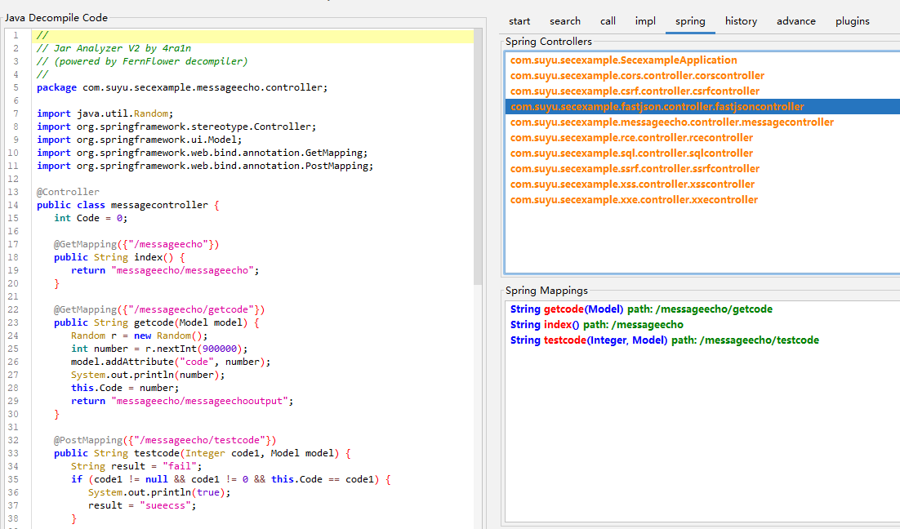
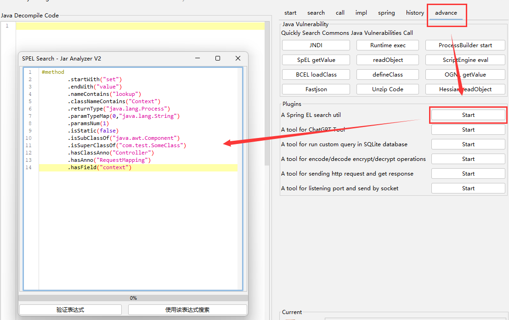
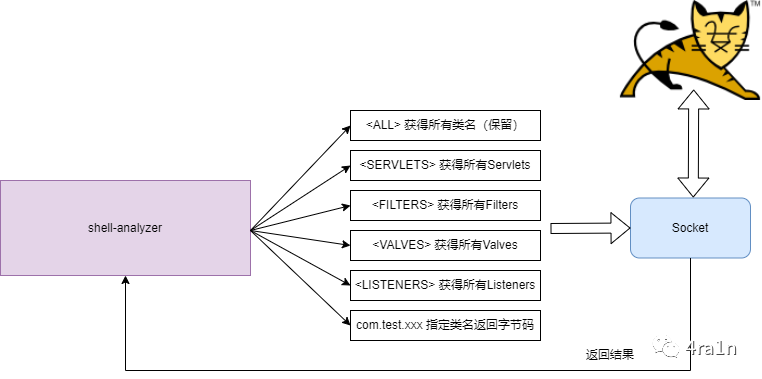

# Jar-Analyzer V2

[中文版本](../README.md)

[CHANGE LOG](../src/main/resources/CHANGELOG.MD)


`Jar Analyzer` is a GUI tool for analyzing `Jar` files:
- Supports analysis of large `Jars` and batch analysis of `Jars`
- Conveniently searches for method call relationships
- Analyzes `LDC` instructions to locate strings in `Jar` files
- One-click analysis of `Spring Controller/Mapping`
- Advanced analysis of method bytecode and instructions
- One-click decompilation, optimized handling of inner classes
- One-click generation of `CFG` analysis results for methods
- One-click generation of `Stack Frame` analysis results for methods
- Remote analysis of components such as `Servlet` in `Tomcat`
- Advanced analysis using custom `SQL` statements
- Allows modification of method names directly from the bytecode level (testing feature)

More features are under development.

For questions and suggestions, please feel free to raise an issue.

[Go to download](https://github.com/jar-analyzer/jar-analyzer/releases/latest)

Uses of `Jar Analyzer`:
- Scenario 1: Analyze which `Jar` a particular method is defined in from a large number of `JARs` (down to the specific class and method)
- Scenario 2: Analyze where `Runtime.exec` method is called from a large number of `JARs` (down to the specific class and method)
- Scenario 3: Analyze where the string `${jndi` appears in a large number of methods (down to the specific class and method)
- Scenario 4: Analyze information about `Spring Controller/Mapping` from a large number of `JARs` (down to the specific class and method)
- Scenario 5: Deeply analyze parameter passing in `JVM` instructions within a method (with graphical interface)
- Scenario 6: Deeply analyze `JVM` instructions and stack frame status in a method (with graphical interface)
- Scenario 7: Deeply analyze the `Control Flow Graph` of a method (with graphical interface)
- Scenario 8: Analyze `Servlet/Filter/Listener` information in a `Tomcat` instance remotely

## Some Screenshots

Instruction Analysis


`CFG` Analysis


Graphical `Stack Frame` Analysis


Analysis of `Spring Framework`



Support for `tomcat` analysis starting from version `2.8` (one-click check for memory shells)


Custom `SQL` statement analysis


Method call search (supports `equals/like` options, supports blacklisting)


Method call relationships


## Expression Search

Expression search is located on the homepage and in the `Plugins` section of `Advance`



Starting from version `2.12`, super powerful expression search is supported, allowing you to combine freely to search for the information you want

Since this feature has been migrated from `Jar Analyzer V1` version, the old version uses in-memory database with higher efficiency, while the new version uses `sqlite` for querying, which may reduce the query speed

| Expression        | Parameters | Function                     | 
|:------------------|:-----------|:-----------------------------|
| nameContains      | String     | Method name contains         |
| startWith         | String     | Method starts with           |
| endWith           | String     | Method ends with             |
| classNameContains | String     | Class name contains          |
| returnType        | String     | Method return type           |
| paramTypeMap      | int String | Method parameter mapping     |
| paramsNum         | int        | Number of method parameters  |
| isStatic          | boolean    | Whether the method is static |
| isSubClassOf      | String     | Subclass of which class      |
| isSuperClassOf    | String     | Superclass of which class    |
| hasAnno           | String     | Method annotation            |
| hasClassAnno      | String     | Class annotation             |
| hasField          | String     | Class field                  |

Note:
- `returnType` and `paramTypeMap` require full class names, e.g., `java.lang.String`, basic types can be written directly, e.g., `int`
- `isSubClassOf` and `isSuperClassOf` require full class names, e.g., `java.awt.Component`
- `hasAnno` and `hasClassAnno` do not require full class names, just write them directly, e.g., `Controller`

### 1. Basic Search

The basis of the search is methods, specifying what kind of methods you want to search for

For example, if I want to search for methods that start with `set` and end with `value`

```java
#method
        .startWith("set")
        .endWith("value")
```

For example, if I want to search for methods whose class name contains `Context` and method name contains `lookup`

```java
#method
        .nameContains("lookup")
        .classNameContains("Context")
```

For example, if I want to search for methods of type `Process` with 3 parameters and the second parameter is of type `String`

```java
#method
        .returnType("java.lang.Process")
        .paramsNum(3)
        .paramTypeMap(1,"java.lang.String")
```

### 2. Subclasses and Superclasses

For example, if we want to find all subclasses of `javax.naming.spi.ObjectFactory` (including subclasses' subclasses, etc.)

Write the following rule, and the program will recursively find all the parent classes

```java
#method
        .isSubClassOf("javax.naming.spi.ObjectFactory")
```

If you want to find all the parent classes of a certain class, use `isSuperClassOf` (note the full class name)

Note that the above will directly find all the methods of all classes that meet the conditions, so I suggest adding some filtering

For example

```java
#method
        .isSubClassOf("javax.naming.spi.ObjectFactory")
        .startWith("xxx")
        .paramsNum(0)
```

### 3. Annotation Search

For example, if we want to find all classes annotated with `@Controller`

Write the following rule

```java
#method
        .hasClassAnno("Controller")
```

For example, if we want to find all methods annotated with `@RequestMapping`

```java
#method
        .hasAnno("RequestMapping")
```

Similarly, since we find all methods of all classes that meet the conditions, I suggest adding some filtering

### 4. Real Examples

Now we have a `Spring Controller`

I want to search for methods in a

certain `Controller` that contain the `userService` field and are `GetMapping` methods

```java
@Controller
public class sqlcontroller {
    @Autowired
    private UserService userService;

    @GetMapping({"/sql"})
    public String index(Model model, UserQuery userQuery) {
        PageInfo userPageInfo = this.userService.listUserByName(userQuery);
        model.addAttribute("page", userPageInfo);
        return "sql/sql";
    }
}
```

So we can write an expression like this

```java
#method
        .isStatic(false)
        .hasClassAnno("Controller")
        .hasAnno("GetMapping")
        .hasField("userService")
```

Refer to the image


## Notes

### Display Issues

If your Mac cannot display completely, please check "More Space" in the display settings


### Garbled Text Issues

Note:
- Do not double-click to start on Windows, please use `java -jar` or double-click the `.bat` script to start
- If garbled text appears when starting with `java -jar`, add the `-Dfile.encoding=UTF-8` parameter

### Display Issues

This tool has been adapted for `1080P` resolution (considering that most machines should be greater than or equal to this resolution)

If your computer cannot display normally at `1080P`, please adjust the scaling to `100%`

For example, in Windows 11: right-click on display settings


### Principle Related

Basic principle of this tool:
- Unzips all `Jar` files to the `jar-analyzer-temp` directory
- Constructs a database file `jar-analyzer.db` in the current directory
- Creates a file `.jar-analyzer` in the current directory to record the status


Note: When there are a large number or huge size of `Jars`, it may lead to huge temporary directory and database files

### Command Line Usage

If you don't want to use the GUI version, this project also supports command line mode:

```text
Usage: java -jar jar-analyzer.jar [command] [command options]
  Commands:
    build      build database
      Usage: build [options]
        Options:
          --del-cache
            delete old cache
            Default: false
          --del-exist
            delete old database
            Default: false
          -j, --jar
            jar file/dir

    gui      start jar-analyzer gui
      Usage: gui
```

Example: Analyze and build a database for the `test.jar` in the current directory, and delete the cache and the old database in the current directory

```shell
java -jar jar-analyzer.jar build --jar 1.jar --del-cache --del-exist
```

### Video Demo

[Bilibili Video Tutorial](https://www.bilibili.com/video/BV1ac411S7q4/)

## Release Notes

All downloadable files are built by `Github Actions` and provide the following four types:

- Recommended `embed` version with embedded `JRE 8` startup script (**no need to install separately, one-click start**)
- `system` version using system `JDK` startup script (requires installation of `JDK` separately)
- `linux` version with built-in `shell` startup script (requires installation of `JDK/JRE` separately)
- Simple `jar` file without startup script (start with `java -jar`)

The `embed` version is recommended, extensively tested, and fully supports the `tomcat-analyzer` module

As this tool has been tested only in `Windows` and `Java 8`, there may be unknown issues in other environments, please feel free to raise an issue

## Subprojects

### Tomcat Analyzer

This project is located in `me.n1ar4.shell.analyzer`, which is a tool for analyzing memory shells in `Tomcat`

[Code](../src/main/java/me/n1ar4/shell/analyzer)

This project was originally named `shell-analyzer` but is now renamed `tomcat-analyzer`

(1) Step 1: Detect the process and `Attach`


To prevent the target from being maliciously exploited, you need to enter a password

**Note: Although a password is used for protection, there is still a risk of denial of service, etc., so do not use it in production environments. It is currently suitable for learning and analyzing on self-built target machines**

(2) Step 2: Check and analyze

Click **Refresh** to get real-time data

(3) Double-click on any class to `Dump` and decompile

(4) Copy the class name over to fix the memory shell


After the `Agent` is dynamically `Attached` to the target, a port (10032) is opened for listening:
- This port deserializes the received data and then processes it. I have set up a whitelist for deserialization protection
- When the `Agent` is started, a password is set. If the password does not match the client connection, data cannot be obtained
- Why choose port 10032? Because this number represents...


This port is used to receive instructions in real-time and process them, and then return data. The image shows some instructions (not complete)



Supports one-click detection of memory shell types

| Type     | Class Name                           | Method Name        | 
|:---------|:-------------------------------------|:-------------------|
| Filter   | javax.servlet.Filter                 | doFilter           | 
| Filter   | javax.servlet.http.HttpFilter        | doFilter           | 
| Servlet  | javax.servlet.Servlet                | service            | 
| Servlet  | javax.servlet.http.HttpServlet       | doGet              | 
| Servlet  | javax.servlet.http.HttpServlet       | doPost             | 
| Servlet  | javax.servlet.http.HttpServlet       | doHead             | 
| Servlet  | javax.servlet.http.HttpServlet       | doPut              | 
| Servlet  | javax.servlet.http.HttpServlet       | doDelete           | 
| Servlet  | javax.servlet.http.HttpServlet       | doTrace            | 
| Servlet  | javax.servlet.http.HttpServlet       | doOptions          | 
| Listener | javax.servlet.ServletRequestListener | requestDestroyed   | 
| Listener | javax.servlet.ServletRequestListener | requestInitialized | 
| Valve    | org.apache.catalina.Valve            | invoke             |

### Y4-HTTP

This project is located in `me.n1ar4.http`, which is a manually crafted and parsed `HTTP/1.1` protocol `HTTP` client library

[Code](../src/main/java/me/n1ar4/http)

### Y4-JSON

This project is located in `me.n1ar4.y4json`, which is a simple `JSON` serialization and deserialization library defined in the style of `Fastjson API`

[Code](../src/main/java/me/n1ar4/y4json)

### Y4-LOG

This project is located in `me.n1ar4.log`, which is a logging library imitating the `Log4j2 API`

[Code](../src/main/java/me/n1ar4/log)

## How

to Build

Please refer to the `Github Actions` code: [build](https://github.com/jar-analyzer/jar-analyzer/blob/master/.github/workflows/build.yml)

## Others

If you want to experience the old version (no longer maintained) of `Jar Analyzer`, you can visit:
- https://github.com/4ra1n/jar-analyzer-cli
- https://github.com/4ra1n/jar-analyzer-gui

Why I choose `Jar Analyzer V2` instead of `IDEA`:
- Because `IDEA` does not support analyzing `Jar` packages without source code
- This tool has some advanced features that `IDEA` does not support (instruction/CFG/Stack analysis)

(1) What are the relationships between methods

```java
class Test{
    void a(){
        new Test().b();
    }
    
    void b(){
        Test.c();
    }
    
    static void c(){
        // code
    }
}
```

If the current method is `b`

For `a`, its `callee` is `b`

For `b`, its `caller` is `a`

(2) How to solve the problem of interface implementation

```java
class Demo{
    void demo(){
        new Test().test();
    }
}

interface Test {
    void test();
}

class Test1Impl implements Test {
    @Override
    public void test() {
        // code
    }
}

class Test2Impl implements Test {
    @Override
    public void test() {
        // code
    }
}
```

Now we have data like `Demo.demo -> Test.test`, but actually it's `Demo.demo -> TestImpl.test`.

So we add new rules: `Test.test -> Test1Impl.test` and `Test.test -> Test2Impl.test`.

First make sure the data is not lost, then we can manually analyze the decompiled code
- `Demo.demo -> Test.test`
- `Test.test -> Test1Impl.test`/`Test.test -> Test2Impl.test`

(3) How to solve inheritance relationships

```java
class Zoo{
    void run(){
        Animal dog = new Dog();
        dog.eat();
    }
}

class Animal {
    void eat() {
        // code
    }
}

class Dog extends Animal {
    @Override
    void eat() {
        // code
    }
}

class Cat extends Animal {
    @Override
    void eat() {
        // code
    }
}
```
The bytecode for `Zoo.run -> dog.cat` is `INVOKEVIRTUAL Animal.eat ()V`, but we only have this rule `Zoo.run -> Animal.eat`, losing the `Zoo.run -> Dog.eat` rule

In this case, we add new rules: `Animal.eat -> Dog.eat` and `Animal.eat -> Cat.eat`

First make sure the data is not lost, then we can manually analyze the decompiled code
- `Zoo.run -> Animal.eat`
- `Animal.eat -> Dog.eat`/`Animal.eat -> Cat.eat`

## Acknowledgments

Related recommendations:
- Traditional decompilation tool `JD-GUI` project: https://github.com/java-decompiler/jd-gui
- Powerful decompilation tool `JADX` project: https://github.com/skylot/jadx
- Proprietary `GDA` tool: https://github.com/charles2gan/GDA-android-reversing-Tool
- Tools for directly editing bytecode: https://github.com/Col-E/Recaf

Thanks to the following projects for providing ideas and code
- https://github.com/JetBrains/intellij-community/tree/master/plugins/java-decompiler/engine
- https://github.com/bobbylight/RSyntaxTextArea
- https://github.com/JackOfMostTrades/gadgetinspector
- https://github.com/lsieun/learn-java-asm
